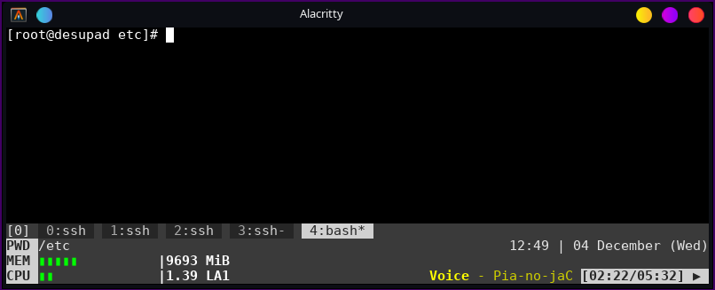

# Tmux helper
Small app that perform system check and print TMUX friendly output.

###Features:
1. `tmux-helper -cb` print cpu load with bar.
2. `tmux-helper -mb` print memory usage with bar.
3. `tmux-helper -p` show current player status using d-bus.

###Building 
`cargo build --release`
or get binary on release page

###Customization
Colours are hardcoded but it's easy to change it. It defined as CONST in very beginning of main.rs file.
